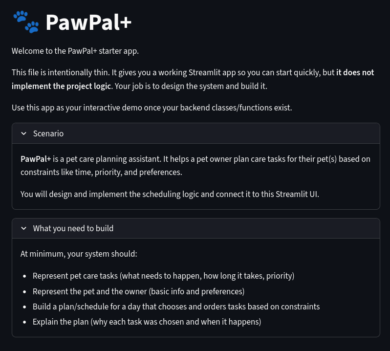
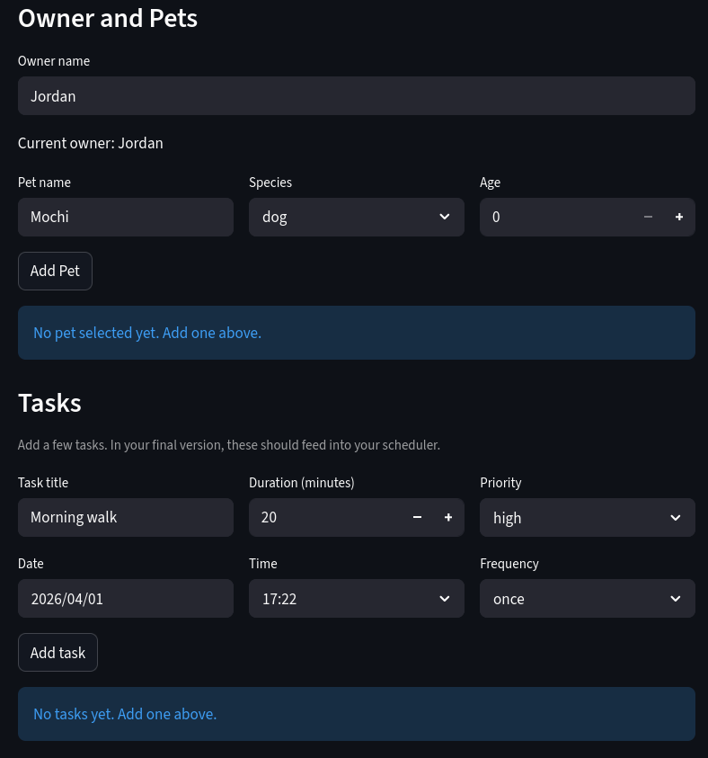
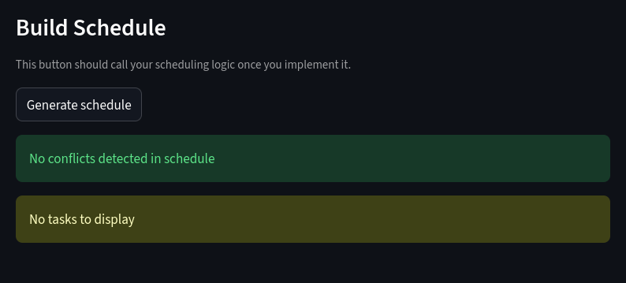

# PawPal+

## Demo Images





## Description

PawPal+ is a pet care scheduling application designed to help pet owners manage their pets' daily tasks and routines. The application allows users to add pets, schedule tasks such as walks and medication, and view their daily schedule. It also includes features for detecting scheduling conflicts and handling recurring tasks.

### Setup

```bash
python -m venv .venv
source .venv/bin/activate  # Windows: .venv\Scripts\activate
pip install -r requirements.txt
```

## Features

### Task Management
- **Add/edit tasks** — each task stores a title, date, scheduled time, duration, priority (`low`/`medium`/`high`), and completion status.
- **Multi-pet support** — an owner can have multiple pets; tasks belong to individual pets and are aggregated across all pets.
- **Duplicate pet guard** — adding a pet with identical details to an existing one reuses the existing pet instead of creating a duplicate.

### Scheduling Algorithms

#### Sorting by Scheduled Time
`Scheduler.organize_tasks_for_date(date)` collects all tasks for a given date (defaulting to today) and returns them sorted ascending by `scheduled_time`. This produces a chronologically ordered daily plan.

#### Filtering by Completion Status and Pet Name
`Scheduler.filter_tasks(completed, pet_name)` applies AND-logic filters across all pets:
- `completed=True/False` — show only done or pending tasks.
- `pet_name="..."` — restrict results to a specific pet (case-insensitive match).

#### Conflict Detection
`Scheduler.detect_task_conflicts()` detects overlapping tasks per pet using a sweep-line approach:
- Tasks are sorted by start time.
- A 15-minute buffer is applied to tasks with no duration (treated as point events).
- Consecutive tasks are compared; if a later task's start time falls within the current task's end time (or buffer window), a conflict is recorded.
- A sliding window (`ei = max(ei, ej)`) handles chains of overlapping tasks.
- Conflicts are returned as `(Pet, Task, Task)` triples and displayed in the UI as a warning table.

#### Daily and Weekly Recurrence
`Scheduler.mark_task_complete(task)` handles recurring tasks:
- When a task with `frequency="daily"` is marked complete, a new identical task is automatically created for the next day.
- When `frequency="weekly"`, the next occurrence is scheduled one week later.
- One-time tasks (`frequency="once"`) are simply marked done with no follow-up created.

### UI (Streamlit)
- Owner and pet info entry with live status display.
- Task entry form (title, date, time, duration, priority, frequency).
- "Generate schedule" button that runs conflict detection and displays the sorted daily plan as a table.

## Testing PawPal+

`python -m pytest` to run tests in `test_pawpal.py`. Tests cover adding pets and tasks, retrieving tasks by date, detecting conflicts, and marking tasks as complete.

Confidence level 3/5. The core functionality is tested, but there may be edge cases that haven't been covered yet.